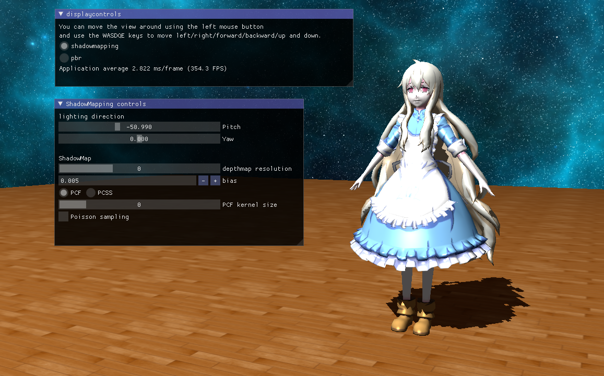
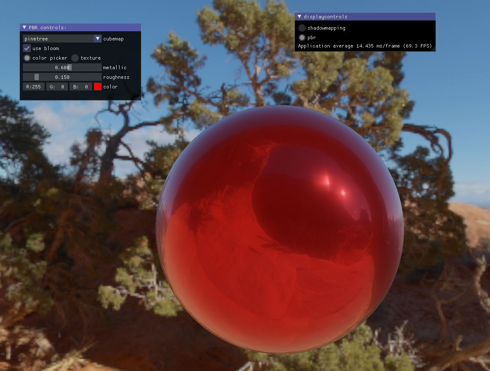

## SmPbrRender ##
*A little OpenGL application which implements shadow mapping and physically based rendering*

## Main Features
- Shadow mapping with PCF
- Shadow mapping with PCSS
- Physically-Based Rendering
- Bloom
